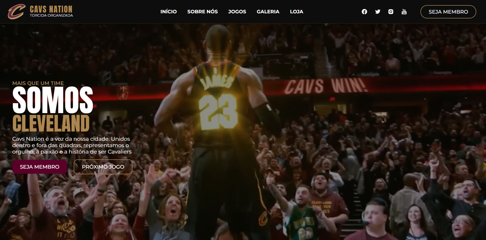
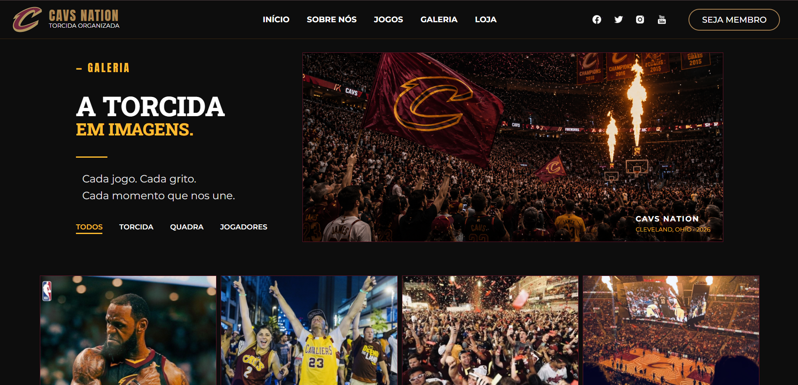
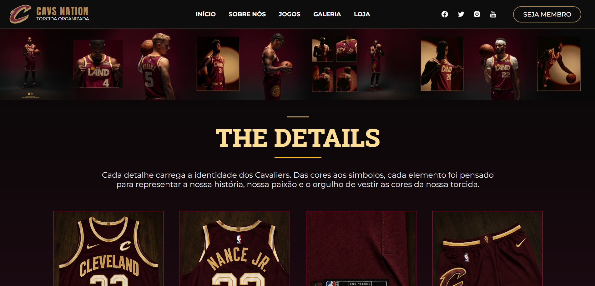

# Cavs Nation

## Sobre o projeto

O Cavs Nation foi um projeto desenvolvido em aula para a disciplina de Web Design - Front End.

A atividade proposta pelo professor consistia em um sorteio de times de basquete. Cada aluno ou grupo recebeu um time e teve como desafio criar um site inspirado em uma torcida organizada, utilizando elementos relacionados à identidade e ao universo do time sorteado.

Neste projeto, o time escolhido foi o **Cleveland Cavaliers**, e a partir disso foi desenvolvido o Cavs Nation.

## Objetivo

A ideia do projeto foi criar um site que representasse uma torcida de basquete, utilizando elementos visuais e conteúdos relacionados ao time para construir uma identidade própria para a página.

Durante o desenvolvimento, também colocamos em prática os conteúdos aprendidos em aula sobre criação e estilização de páginas web.

## Tecnologias utilizadas

* HTML5
* CSS3
* Flexbox

## Conceitos praticados

* Estruturação de páginas com HTML
* Estilização com CSS
* Organização de elementos utilizando Flexbox
* Tipografia e identidade visual
* Criação e organização de uma interface web

## Projeto acadêmico

Projeto desenvolvido para fins acadêmicos durante as aulas de Web Design - Front End.

## Preview

